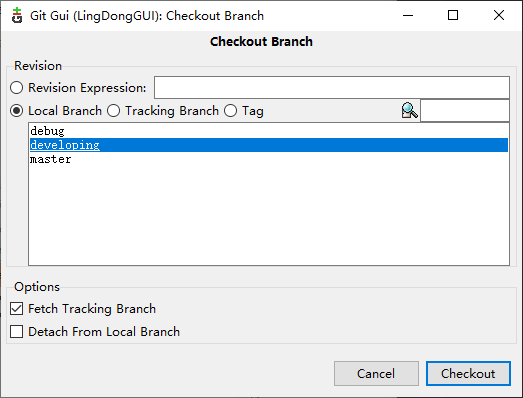
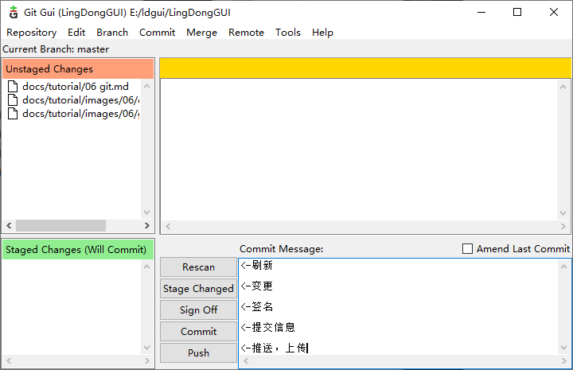

## 安装Git

登录[官网](https://git-scm.com/download/win)下载Git
    
## 注册gitee账户，并在git登录

1. 注册gitee账户

2. 获取SSHKey

    任意目录点击鼠标右键，选择 **Open Git bash here**，弹出命令行窗口

    输入命令 ssh-keygen -t rsa -C "youremail@youremail.com"  

    三次回车即可生成 ssh key

3. 查看public key
    
    输入命令 cat ~/.ssh/id_rsa.pub

4. 添加key到gitee
    
    将public key复制到gitee的[SSH公钥](https://gitee.com/profile/sshkeys)

    在命令行中输入命令 ssh -T git@gitee.com

5. 设置基本信息

    在命令行中输入命令
    
    git config --global user.name "yourname"
    
    git config --global user.email "youremail@youremail.com"

    name和email是gitee注册时使用的名称和邮箱。

    ssh key设置[教程](https://help.gitee.com/base/account/SSH%E5%85%AC%E9%92%A5%E8%AE%BE%E7%BD%AE)

## 贡献代码

[官方说明](https://help.gitee.com/pull-request)

1. fork代码
    先上gitee，将ldgui的代码fork一份到自己账户

2. clone自己仓库的ldgui源码
    
    假设你的用户名是AAA，将源码放置在F:/LingDongGUI目录下。

    网页切换到自己fork的项目中，点击 **克隆/下载** 按键，复制连接。连接为https://gitee.com/AAA/LingDongGUI.git。

    打开F盘，按鼠标邮件右键，选择 **Open Git bash here**，弹出命令行窗口，输入git clone https://gitee.com/AAA/LingDongGUI.git ,回车，即可将源码下载到F:/LingDongGUI目录下。

    

3. 在F:/LingDongGUI目录下点击鼠标右键，选择 **Open Git Gui here**，弹出git图形用户界面。

4. 点击Branch->checkout，选择developing分支，点击checkout。

    

5. 点击Repository->visualze all branch，确认developing分支为最新代码。如果不是最新，请选择最新代码，在注释文字上点击右键，选择**Reset developing branch to here**，再选择hard，然后点击**OK**。强制切换为最新代码。

6. 修改代码

7. 提交代码
    将代码提交到自己的仓库，在F:/LingDongGUI目录下点击鼠标右键，选择 **Open Git Gui here**，弹出git图形用户界面。

    下方Commit Message输入提交信息，按顺序点击rescan，stage changed，sign off，commit，push，即可提交代码。

    

8. 提交代码到ldgui作者仓库
    登录gitee网页，切换到自己ldgui仓库developing分支，会看到多了一个Pull Request按键，点击后，按要求填写，就会将代码推动到ldgui作者仓库，等待审核合并。建议直接在qq、微信通知一下作者。
